<div align="center">

# Leadflow

### From first hello to finished job.

Lead-to-booking analytics for home-service businesses. It joins **inquiries, bookings, and completed jobs** to show which leads are slipping, where bookings fall through, and which sources turn into real work.

[](https://github.com/Hasnain3201/lead-to-booking-dashboard/actions/workflows/ci.yml)


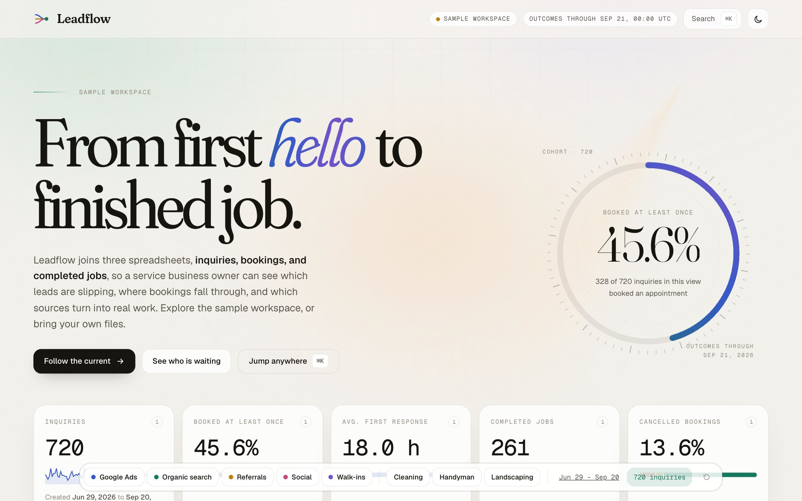

</div>

## The problem, in plain English

A small home-services company tracks its work in three spreadsheets: one for **inquiries** (someone asks for a quote), one for **bookings** (an appointment is made), and one for **completed jobs**. Because they live apart, the owner can't easily answer the Monday-morning questions:

- *Who asked for help and never heard back?*
- *Where do bookings fall through?*
- *Which lead sources actually turn into finished, paid work?*

Leadflow checks the three files for problems, links every job back to the booking and inquiry it came from, and turns them into one trustworthy picture, with a follow-up list and a one-page weekly brief the owner can act on.

## See it move

Every particle below is **one real inquiry record**. It flows from its lead source through first response and booking to the furthest outcome it reached. Leads that never book drift away at the booking stage. Hover a particle to identify it, or click it to open the full record.

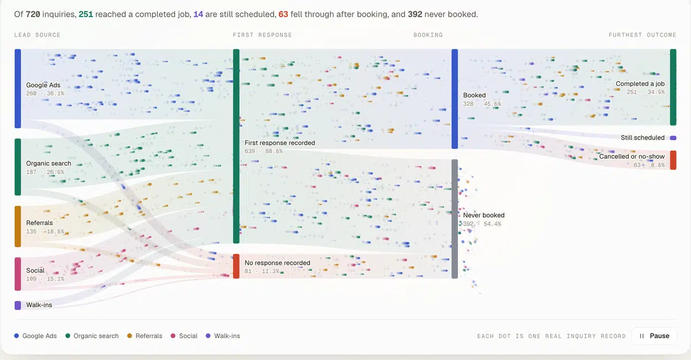

## Feature tour

<table>
<tr>
<td width="50%">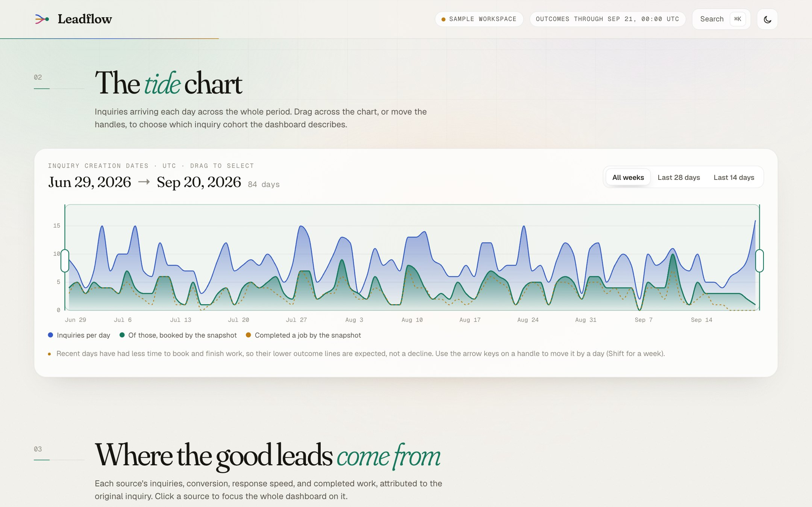<br><b>Tide chart.</b> Drag across the daily timeline, or use the arrow keys on a handle, to choose which inquiry cohort the whole dashboard describes.</td>
<td width="50%">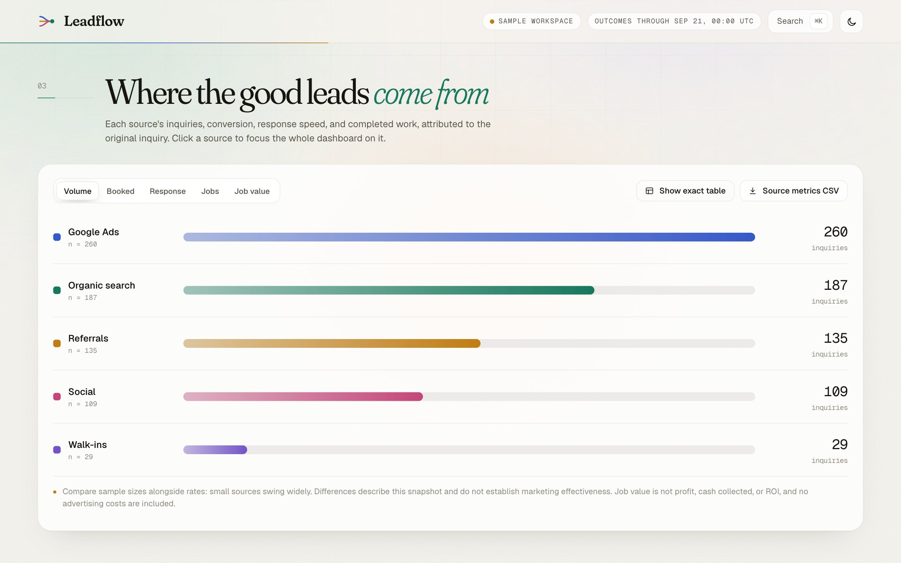<br><b>Lead sources.</b> Compare volume, conversion, response speed, jobs, and job value. Bars re-sort when you switch metrics, sample sizes are always shown, and an exact table is one click away.</td>
</tr>
<tr>
<td>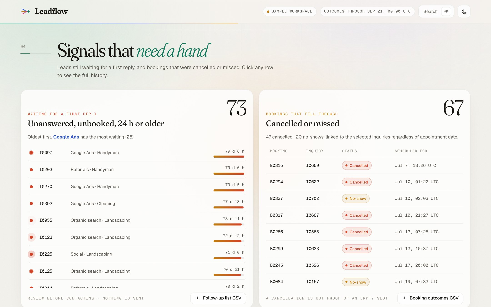<br><b>Needs attention.</b> Leads waiting more than 24 hours with no reply and no booking, oldest first, next to every cancelled or missed booking. Both download as CSV.</td>
<td>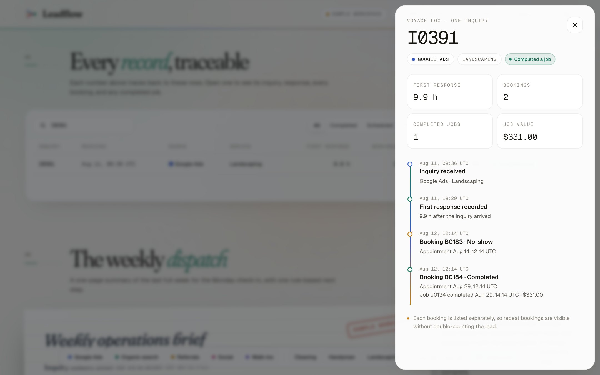<br><b>Voyage log.</b> Open any inquiry to see its response, every booking, and any completed job. Repeat bookings stay visible without double-counting the lead.</td>
</tr>
<tr>
<td>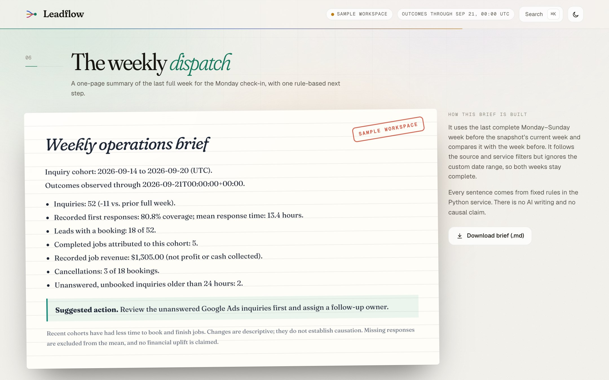<br><b>Weekly dispatch.</b> A one-page Monday brief for the last full week, with one rule-based next step. Every sentence is generated by fixed rules, not AI, and traces to a visible number.</td>
<td>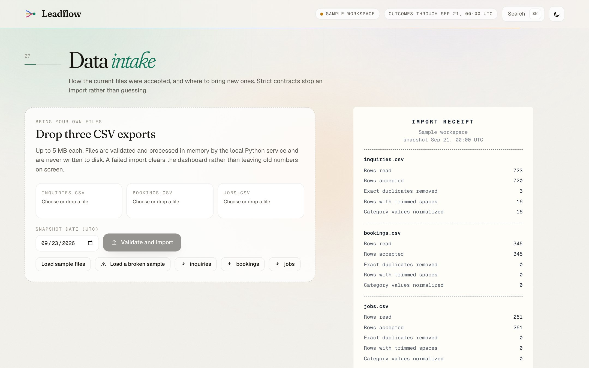<br><b>Data intake.</b> Drop three CSV exports. Validation prints a receipt showing rows read, rows accepted, duplicates removed, and values normalized.</td>
</tr>
<tr>
<td>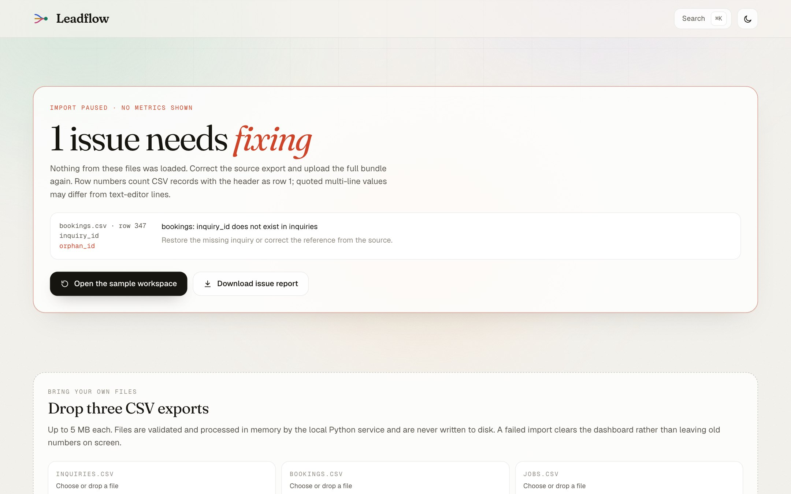<br><b>Honest failures.</b> A broken file stops the import and <i>clears every metric</i>. Each issue lists the file, row, column, and how to fix it.</td>
<td>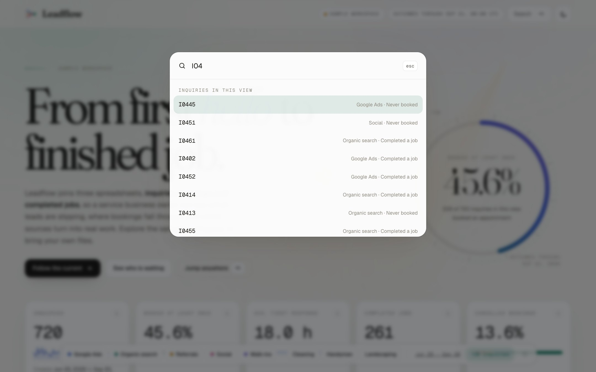<br><b>⌘K anywhere.</b> Jump to any inquiry, section, download, or theme from the command palette.</td>
</tr>
<tr>
<td>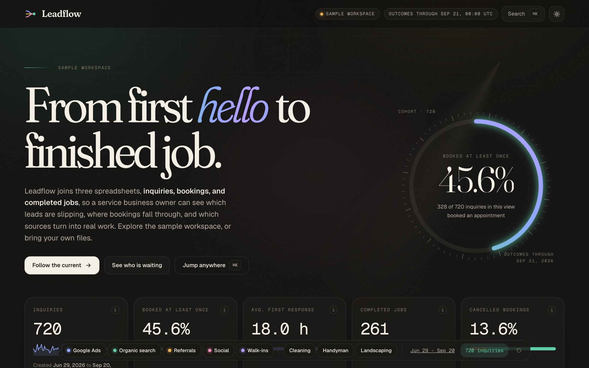<br><b>Light and dark.</b> A warm graphite dark theme grows in as a circle from the toggle.</td>
<td>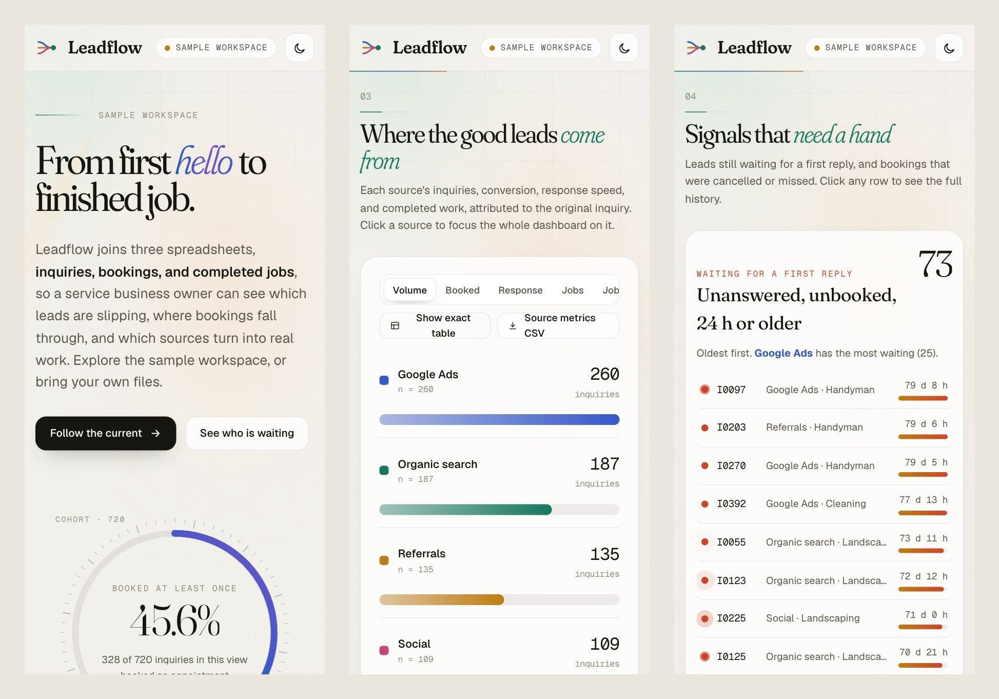<br><b>Works on phones.</b> Layouts reflow down to 390 px wide, and the filter dock scrolls.</td>
</tr>
</table>

### Small details

- **Numbers never lie in motion.** When filters change, digits slide from the old value to the new one. They never count up through values that don't exist.
- **A soft pastel aurora, fine film grain, and a slow light sweep** give the porcelain surfaces depth, and every panel has a cursor-following spotlight.
- **Accessible by default.** Reduced-motion settings pause the particle flow and turn off decorative effects. Source nodes, date handles, rows, the drawer, and the palette all work from the keyboard. Hidden data tables describe the flow chart for screen readers.
- **Offline-friendly.** Fonts are bundled, and no account, API key, or internet connection is needed after installation.

## Quick start

You need **Python 3.11+**, **Node.js 20.19+ or 22.12+**, and **Git**.

```sh
git clone https://github.com/Hasnain3201/lead-to-booking-dashboard.git
cd lead-to-booking-dashboard

# Python environment and the analytics package
python3 -m venv .venv
source .venv/bin/activate            # Windows: .venv\Scripts\activate
python -m pip install -r requirements.lock.txt
python -m pip install -e . --no-deps --no-build-isolation

# Build the interface once
npm --prefix frontend ci
npm --prefix frontend run build

# Run it
python serve.py
```

Your browser opens **http://127.0.0.1:8765** with a sample workspace loaded, and you can bring your own files from *Data intake*. The server listens on your computer only. Press Control-C to stop it.

On a Mac, you can double-click **`open-dashboard.command`** instead. It builds the interface the first time and then starts everything.

<details>
<summary><b>Other ways to run it</b></summary>

| Goal | Command |
|---|---|
| Develop the interface with hot reload | Run `python serve.py --no-browser`, then `npm --prefix frontend run dev` and open http://localhost:5173 |
| Use a different port | `python serve.py --port 9000` |
| Classic Streamlit analyst view | `python -m streamlit run app.py` |
| Public demo without uploads | `LEADFLOW_DISABLE_UPLOADS=1 python serve.py` |
| Regenerate the sample workspace | `python scripts/generate_demo.py` (seed 42, snapshot 2026-09-21) |
| Regenerate README screenshots | Start the app, then `python scripts/capture_screenshots.py --scale 1.5 --jpeg --animate --out docs/assets` (needs Google Chrome) |

</details>

## Try it with your own files

The **Data intake** section accepts three UTF-8 CSV files with these exact headers:

| File | Columns |
|---|---|
| `inquiries.csv` | `inquiry_id, created_at, source, service, first_response_at` |
| `bookings.csv` | `booking_id, inquiry_id, booked_at, scheduled_at, status` |
| `jobs.csv` | `job_id, booking_id, completed_at, revenue_usd` |

Timestamps need a timezone, for example `2026-09-14T10:00:00Z`. Example files are in [`data/demo/`](data/demo), and the app can download them for you. Use **Load a broken sample** to watch validation reject a bookings file that references a missing inquiry. The full rules are in the [CSV contract](docs/DATA-CONTRACT.md).

## How it works

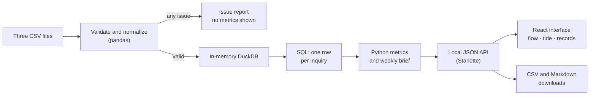

- **One row per inquiry, always.** The SQL first totals jobs per booking, then bookings per inquiry, and only then calculates rates. A lead with three bookings still counts once toward conversion and response time. See [`sql/cohort.sql`](sql/cohort.sql).
- **Python is the single source of truth.** The interface formats and draws what the API returns and never recalculates a metric. Tests reconcile the API against the same functions.
- **Strict, explainable validation.** Conflicting IDs, orphan records, impossible timelines, unknown categories, and fractional cents block the whole import, with the file, row, and column of each problem.
- **Uploads stay in memory.** Files are parsed without touching disk, limited to 5 MB each, and discarded when the server stops.

## What the numbers mean

| Metric | Definition |
|---|---|
| **Booked at least once** | Inquiries with one or more bookings ÷ all inquiries. A cancelled booking still counts as booked. |
| **Average first response** | Mean hours from inquiry to first recorded reply. Missing replies are excluded, never counted as zero, and coverage is shown next to it. |
| **Completed jobs** | Job records belonging to the selected inquiries. Job value is not profit, cash collected, or return on ad spend. |
| **Cancellation rate** | Cancelled bookings ÷ all bookings from these inquiries. No-shows are reported separately. |
| **Needs a reply** | No recorded response, no booking, and at least 24 hours old at the snapshot. |

Date filters select *when inquiries arrived*; their outcomes count through the data snapshot. The full definitions and caveats are in [METRICS.md](docs/METRICS.md).

## Tests and checks

```sh
source .venv/bin/activate
ruff check . && ruff format --check .
pytest -q                               # 57 tests: metrics, validation, API, and Streamlit
npm --prefix frontend run lint
npm --prefix frontend run build         # TypeScript type check and production build
```

The tests use tiny hand-calculated datasets to prove the math (for example, that a repeat booking can't inflate the response average), reject every class of bad input, and reconcile every API view and export with authoritative totals. GitHub Actions runs all of this on every push. Reproducible load measurements are in [PERFORMANCE.md](docs/PERFORMANCE.md).

## Project structure

```text
serve.py                  Start the local app (API + interface)
frontend/                 React + TypeScript interface (Vite, D3, Motion)
  src/components/         Flow, tide chart, sources, attention, records, drawer, intake…
src/leadflow/
  data.py                 CSV contracts, validation, issue reports
  analytics.py            DuckDB integration, metrics, weekly brief, exports
  api.py                  Local JSON API over the analytics
sql/cohort.sql            Inquiry-level aggregation
app.py                    Classic Streamlit view
scripts/                  Demo generator, benchmark, JSON export, screenshot capture
data/demo/                Sample workspace CSVs (720 inquiries, 345 bookings, 261 jobs)
data/invalid/             A deliberately broken bookings file
tests/                    pytest suite
docs/                     Metrics, contract, design direction, plan, guides, images
```

## Limitations

- **Descriptive, not causal.** Source differences describe this snapshot. There is no advertising cost data, so there is no ROI.
- **One snapshot.** The files record current booking status only, so historical status changes can't be reconstructed.
- **No capacity model.** A cancellation is not treated as an empty appointment slot.
- **Single local user.** There are no accounts or hosted database. In-memory processing is not an access-control system, so review privacy and hosting before using real customer data.

## Read more

- [Metric definitions](docs/METRICS.md) and [CSV contract](docs/DATA-CONTRACT.md)
- [Design direction and research board](docs/DESIGN-DIRECTION.md)
- [Frontend data API](docs/FRONTEND-DATA.md)
- [Owner requirements](docs/REQUIREMENTS.md) and [source mapping](docs/SOURCE-MAPPING.md)
- [Three-minute demo script and acceptance checklist](docs/DEMO-GUIDE.md)
- [Implementation plan](docs/IMPLEMENTATION-PLAN.md) and [performance notes](docs/PERFORMANCE.md)

---

<div align="center">
Designed and built by <b>Hasnain Shahzad</b>.
</div>
