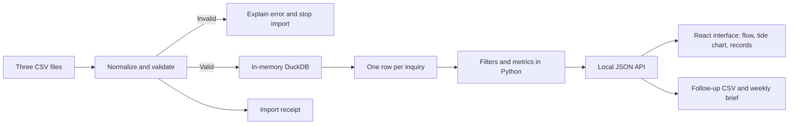

# Leadflow: detailed implementation plan

## Product goal

Help the owner of a home-service business answer: **Which inquiries are being missed, where do bookings fall through, and which lead sources produce completed work?**

Build a trustworthy, explainable tool: SQL, data validation, clear metric definitions, workflow design, and a concrete weekly recommendation. It ships with a generated sample workspace so anyone can explore it; piloting with a business is a separate phase. Every number must trace back to the supplied files.

## Scope and user workflow

One business, three service categories, three CSV types, one local user. The owner opens the dashboard, chooses the demo or uploads matching files, reviews the import receipt, filters an inquiry cohort, examines the funnel and source performance, reviews unanswered leads, then downloads a weekly brief and follow-up list.

Five primary KPIs: inquiry count, lead-to-booking conversion, average first response, completed jobs, and cancellation rate. Response coverage, no-shows, recorded revenue, and the follow-up queue provide supporting context. Source totals link back to the underlying inquiry table.

No login system, hosted database, LLM calls, predictive scoring, live CRM sync, automatic messaging, payments, or automated scraping in v1. No API keys or paid services are required to run locally. The dashboard must remain useful with the internet disconnected after installation.

## Technical choices

| Component | Choice | Purpose |
|---|---|---|
| Runtime | Python 3.11+, project `.venv` | Portable data workflow with isolated packages |
| Interface | React 19 + TypeScript (Vite), D3 geometry, Motion | The Harbor Observatory frontend: custom charts, particle flow, and transitions |
| Local API | Starlette + Uvicorn | Serves the tested Python metrics and the built interface from one local process |
| Classic view | Streamlit + Plotly | The original analyst dashboard, kept as a simple alternative |
| Cleanup | pandas | Parse typed columns and validate CSV contracts |
| Metrics | DuckDB SQL, in memory | Transparent joins and aggregation without a database server |
| Tests | pytest, Starlette TestClient, Streamlit AppTest | Hand-calculated fixtures, API reconciliation, edge cases, UI behavior |
| Style checks | Ruff, oxlint, TypeScript | Consistent formatting and static checks for both languages |
| Version control | Git + GitHub | Private during development; public after the final design and showcase phase |
| CI | GitHub Actions | Python checks plus frontend lint and build on pushes and pull requests |

The SQL first aggregates completed jobs per booking, then bookings per inquiry. Only then does the dashboard compute inquiry metrics. This prevents repeat bookings from double-counting leads or weighting response-time averages incorrectly.



## Data model and decisions to preserve

`inquiries (1) → (many) bookings (1) → (0 or 1) completed jobs`.

- Stable IDs connect records, never names or fuzzy matching.
- Use explicit timezone offsets on input and UTC for all reporting in v1.
- The date range means inquiry creation date, not booking or completion date.
- Every outcome uses the same supplied data snapshot; there is no historic status reconstruction.
- Missing response timestamps remain missing and reduce response coverage.
- A cancelled booking still means the inquiry booked at least once.
- No-shows are separate from cancellations.
- Job revenue is not profit, collected payments, marketing return, or measured financial improvement.
- Unfilled slots cannot be inferred from cancellations; they need a separate appointment-capacity model.

Exact field contracts are in `DATA-CONTRACT.md`; formulas and caveats are in `METRICS.md`.

## Milestones, deliverables, and acceptance criteria

### 0. Project setup and runnable foundation — delivered in this initial setup

Create the Documents folder, virtual environment, dependency lock, install metadata, Git repository, private GitHub remote, launcher, README, project instructions, and CI. Build the deterministic seed generator, demo CSVs, first app screens, SQL query, validation, and regression tests.

Acceptance: launch without credentials; show 720 unique inquiries after removing three duplicate rows; run checks successfully; open all five app sections; create and push the private repository; record precise next steps.

### 1. Requirements and source mapping — 2–3 hours

1. Walk through the owner's Monday routine: review last week, assign unanswered leads, inspect failed bookings, assess lead sources.
2. Create a one-page requirements note listing decisions, users, inputs, expected outputs, and acceptance criteria.
3. Identify which source fields a typical business exports and produce a column mapping worksheet.
4. Decide whether each business wants business-hour response time or elapsed hours, and which timezone they report in.
5. Confirm whether cancellations belong to the inquiry cohort or appointment period before adding another reporting view.

Acceptance: someone without coding knowledge can explain each KPI, its denominator, and what action it supports. All assumptions are recorded, not buried in code.

### 2. Harden ingestion and analytical correctness — 4–6 hours

The initial implementation already has strict contracts, normalization receipts, duplicate handling, relationship checks, and small calculation fixtures. Extend it with:

1. A structured issue report with file, CSV row number, column, issue, and repair guidance; collect several independent issues per run.
2. More fixture bundles for missing files/columns, malformed encoding, mixed offsets, zero records, all-cancelled records, no bookings, and all missing responses.
3. Reconciliation checks that channel totals and filtered exports match the overview.
4. An explicit source-mapping configuration if a real export uses different categories; keep unknown values visible.
5. Decimal or integer-cent revenue arithmetic before financial reconciliation is a real requirement; current floating-point sums are display-only.
6. A measured 10,000- and 100,000-row load test; document hardware, elapsed time, and memory without making untested speed claims.

Acceptance: no silent row loss, no join fan-out, exact hand-calculated counts, consistent denominators, and actionable errors. Failed uploads must never leave the prior dataset displayed as if the import succeeded.

### 3. Refine the owner-facing dashboard — 4–6 hours

1. Review the app in a browser at desktop and narrow widths; refine long labels, contrast, spacing, and chart explanations.
2. Display human-readable source labels and more useful number formatting in exported/source tables.
3. Add a booking-outcome table for cancellations and no-shows with linked inquiry IDs.
4. Add a record detail view showing inquiry → booking(s) → completed job(s), including repeat bookings.
5. Add visible sample sizes and a small-sample caveat to source comparisons; keep default ordering descriptive, not a claim of best performance.
6. Verify keyboard navigation and every download, not only the Streamlit test model.

Acceptance: the owner can identify one follow-up priority and explain a source comparison in under three minutes; empty and invalid states are understandable; displayed and downloaded totals agree.

### 4. Strengthen weekly decision support — 3–4 hours

The initial brief is deterministic Markdown: prior/full-week inquiry counts, cohort outcomes, follow-up backlog, and one rule-based next action. Extend it with:

1. A business-readable headline and explicit response coverage for the reporting cohort.
2. A printable one-page layout, if useful, after content and calculations are stable.
3. Clear comparable-cohort rules before adding conversion deltas (for example, 14-day conversion requires event-level history or frozen snapshots).
4. Owner feedback on whether the suggested action is useful and whether the queue needs owner or priority fields.

Acceptance: every statement can be traced to a visible table or metric; sparse data produces cautious language; no AI or fabricated causal interpretation is needed.

### 5. Packaging and usability review — 3–5 hours

1. Ask a friend or stakeholder to perform three tasks: find an unanswered inquiry, identify a source with completed jobs, and explain cancellation rate.
2. Record observations, task completion, misunderstandings, and revisions. Feedback drives the revisions.
3. Add screenshots, a 90-second demo recording, architecture diagram, and a short case study describing the problem and choices.
4. Complete the final frontend and showcase phase below, verify repository contents and history, then make the repository public.
5. Optionally deploy a **demo-only** app. Disable user uploads on a public deployment until hosting privacy, retention, and access controls are designed. Hosting is not part of this initial setup.

Acceptance: another person can clone and launch using the README; the case study labels the sample workspace; the presenter can explain at least three implementation tradeoffs without relying on code jargon.

### 6. Business pilot — 1–2 weeks once a partner agrees

Get explicit permission to use anonymized exports. Map their fields, agree metric definitions, record a baseline, train one user, collect structured feedback, and observe a short follow-up period. Store any real data in ignored `data/private/`, never Git. Reassess authentication and retention before shared hosting. Measure actual adoption, reconciliation errors, and time to prepare the weekly report; document sample size and observation period.

Acceptance: the owner verifies totals against source records and reports a concrete decision the dashboard helped with. Only then report measured impact.

## Final phase: distinctive frontend and public showcase — delivered

Goal: a beautiful, unique, visually striking interface with playful effects, and a polished public repository. The optional real-business pilot does not block this phase.

### What was delivered

- **Research and direction.** A reference board of current award-winning data sites, creative-coding tutorials, and design-system typography guidance is in `DESIGN-DIRECTION.md`, with notes on what each source contributed. The original identity, Harbor Observatory, pairs night-harbor colors with editorial Fraunces type, Geist interface text, and tabular mono numbers.
- **Stack decision.** Streamlit could not support custom layouts and effects without fighting the framework. A dedicated React + TypeScript frontend now talks to a small local Starlette API that wraps the tested Python and SQL. The browser formats and draws; it never recalculates metrics. Streamlit remains as a classic view.
- **Signature interactions.** A particle Sankey where each dot is one real inquiry; a brushable daily tide chart; a circular theme reveal; digit-swap numerals that never show made-up intermediate values; a printed import receipt; and a failure screen that clears every metric.
- **Full experience.** Overview, filter dock, source comparison with an exact table, follow-up queue, cancelled and no-show bookings, searchable records, inquiry drawer, weekly dispatch, uploads, validation errors, and empty and loading states, plus a ⌘K command palette.
- **Accessibility and performance.** Reduced motion pauses the particle current and disables decorative motion. Source nodes, date handles, rows, the drawer, and the palette all work from the keyboard. The flow view held 60 fps in browser measurement.
- **Showcase.** The README uses real captures from `scripts/capture_screenshots.py` (headless Chrome), stored in `docs/assets/`, including an animated recording of the flow view.

### Acceptance

A distinctive, polished interface; useful and accessible effects; verified desktop and mobile workflows; accurate screenshots; a reproducible README; passing checks; and a repository ready to share. Before changing visibility to public, review tracked files and Git history for secrets, private data, and local working notes. Website deployment remains separate scope; a public demo must set `LEADFLOW_DISABLE_UPLOADS=1`.

## Test and review strategy

- Tiny hand-calculated datasets prove conversion, duplicate handling, mean response time, revenue, furthest outcomes, and follow-up thresholds.
- Invalid input tests prove strict rejection of orphan keys, conflicting duplicates, chronology issues, bad statuses, and nonfinite or negative amounts.
- API tests reconcile every view with authoritative totals and cover filters, exports, uploads, and failure payloads.
- Streamlit tests prove demo startup, safe empty filters, and the upload prerequisite screen.
- Browser review covers charts, layout, filter behavior, upload success and failure, and downloaded files. Automated coverage is not a substitute for the manual acceptance checklist in `DEMO-GUIDE.md`.
- CI uses locked Python dependencies on Python 3.11 and `npm ci` for the frontend. Re-resolve deliberately, review changes, and retest when upgrading packages.

## Project structure

```text
serve.py                     Starts the local API and interface (http://127.0.0.1:8765)
frontend/                    React + TypeScript interface (Vite)
src/leadflow/api.py          Local JSON API over the analytics
src/leadflow/data.py         CSV parsing and validation
src/leadflow/analytics.py    SQL integration, metrics, summaries, exports
sql/cohort.sql               Auditable inquiry-level aggregation
app.py                       Classic Streamlit view
scripts/                     Demo generator, benchmark, JSON export, screenshot capture
data/demo/                   Committed sample workspace CSVs and provenance
data/invalid/                Deliberately broken demonstration input
tests/                       Calculation, validation, API, and UI tests
docs/                        Plan, contracts, metrics, design, demo guide, assets
requirements.lock.txt        Exact resolved Python environment
open-dashboard.command       macOS double-click launcher
```

## Primary technical references

- [DuckDB Python API](https://duckdb.org/docs/current/clients/python/overview)
- [Starlette](https://www.starlette.io/)
- [Vite](https://vite.dev/) and [React](https://react.dev/)
- [d3-sankey](https://github.com/d3/d3-sankey) and [Motion](https://motion.dev/)
- [Streamlit app testing](https://docs.streamlit.io/develop/api-reference/app-testing)
